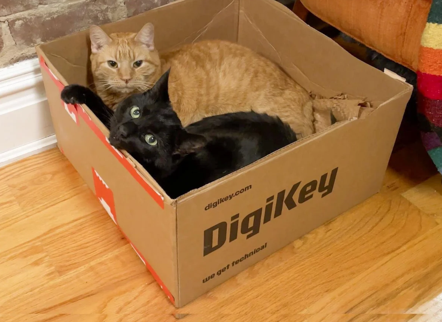
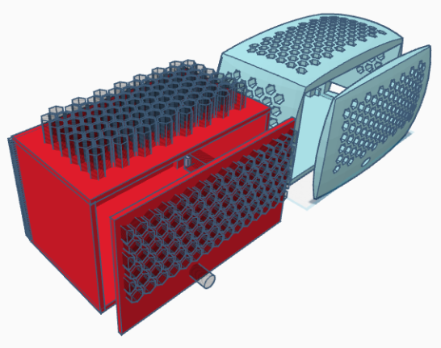
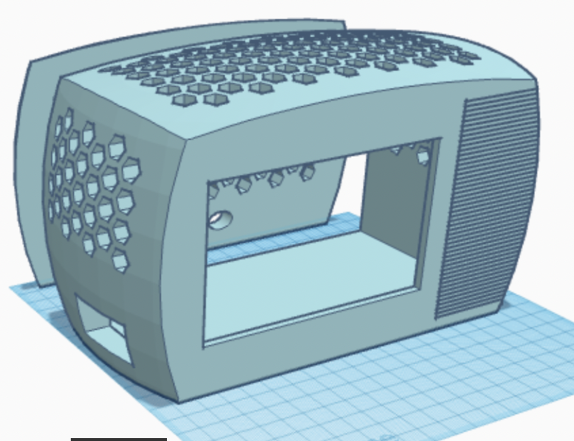

**Total Time Spent: 82 hours**

---

### Daily Logs

**Day 1 – 12/06/2025**  
*Time Spent:* 4 hours  
I began sketching out the idea of building a dedicated Cat TV that doesn't just play videos but feels like a polished device. I searched through different streaming options and started listing required components.
-  

---

**Day 2 – 14/06/2025**  
*Time Spent:* 5 hours  
I researched suitable displays and selected a 5″ HDMI touchscreen. I focused on how to disable its touch function to avoid accidental cat interactions. I also documented how I’d power everything neatly from a single source.

---

**Day 3 – 15/06/2025**  
*Time Spent:* 6 hours  
I designed the 3D enclosure with ventilation and secure internal mounting for the speaker and board. I shaped it to sit close to the ground so cats can view it comfortably without tipping it over.

---

**Day 4 – 16/06/2025**  
*Time Spent:* 5 hours  
I tested different video playback methods. After refining the boot sequence, I managed to auto-launch fullscreen bird videos directly after startup. I documented how to simulate and check playback temperature without overheating.

---

**Day 5 – 17/06/2025**  
*Time Spent:* 6 hours  
I worked on simulations for airflow and evaluated thermal dissipation strategies. I finalized the honeycomb design to keep internal airflow high without compromising on safety or aesthetics.

---

**Day 6 – 18/06/2025**  
*Time Spent:* 7 hours  
I installed and configured the speaker to play rich stereo bird songs. I adjusted volume settings and confirmed they persist between reboots. I also tested the USB-C adapters under load to verify stable power delivery.

---

**Day 7 – 19/06/2025**  
*Time Spent:* 6 hours  
I assembled all parts inside the 3D-printed body. I used hot glue and screws to fix the speaker in place, preventing rattling from bass-heavy sounds. I documented assembly alignment and internal wire paths.
- 

---

**Day 8 – 20/06/2025**  
*Time Spent:* 6 hours  
I finalized cable management and carefully routed power cables to avoid flex stress. I verified that disabling touch input using a power-only USB cable worked reliably and consistently on reboot.

---

**Day 9 – 21/06/2025**  
*Time Spent:* 5 hours  
I watched how my cat interacted with the TV. No unintentional inputs were triggered, and the sounds immediately grabbed her attention. I documented the interaction results and further adjusted sound settings.

---

**Day 10 – 22/06/2025**  
*Time Spent:* 6 hours  
I ran long playback sessions to test thermal performance. I added a heat sink and fan combo to manage temperatures. I documented the results in photos and noted idle vs. stress temperatures.

---

**Day 11 – 23/06/2025**  
*Time Spent:* 6 hours  
I began finalizing my documentation, double-checking every cable, setup step, and screen command to make it beginner-proof. I added a diagram showing where everything connects inside the case.

---

**Day 12 – 24/06/2025**  
*Time Spent:* 5 hours  
I reviewed the power stability with different adapters. I chose a 3A USB-C supply that could handle peak loads without glitching the screen. I simulated what would happen if the adapter lost power mid-playback.

---

**Day 13 – 25/06/2025**  
*Time Spent:* 5 hours  
I conducted a durability test by letting the system run for a full day. Everything performed flawlessly. I documented results, polished the design, and took final photos of the device running next to my cat.
-  

---

**Day 14 – 26/06/2025**  
*Time Spent:* 4 hours  
I wrote up the readme, added wiring photos, and tested the system in low-light to verify screen brightness. I also added cat-proof grid guards on the back of the case to prevent direct contact with fan blades.

---

**Day 15 – 27/06/2025**  
*Time Spent:* 6 hours  
Final check of the project repository. I reviewed all wiring, boot scripts, media settings, documentation, and BOM accuracy. I uploaded all images and finished writing the journal.

---
